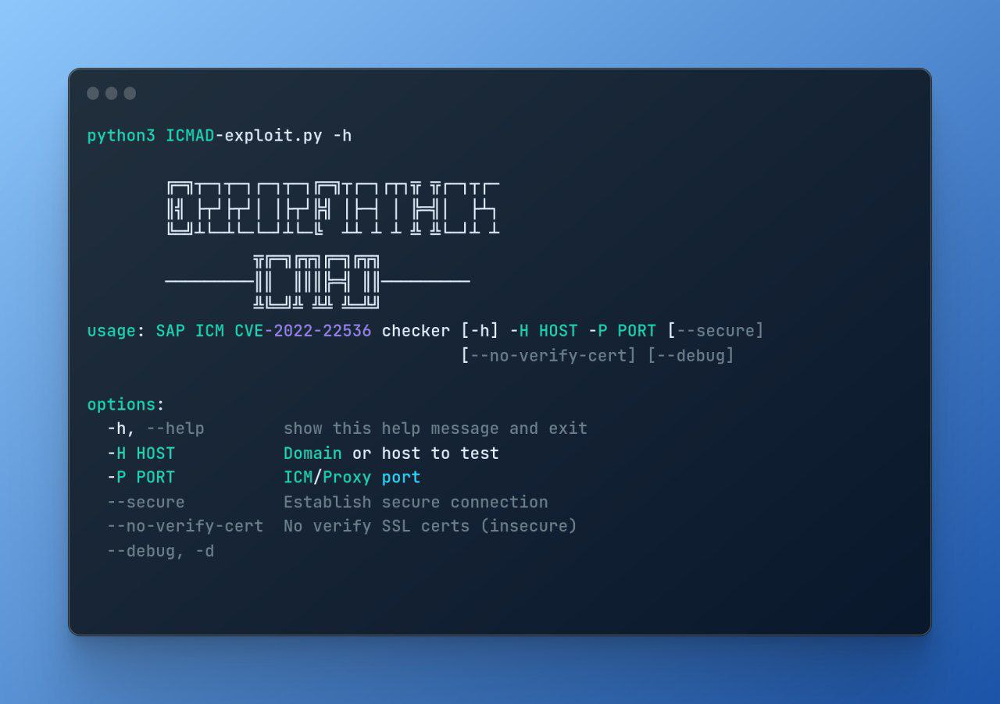

<br/>
<p align="center">
  <a href="https://github.com/errorfiathck/">
    
  </a>

  <h3 align="center">‌ICMAD Exploit</h3>

  <p align="center">
    a simple exploit of ICMAD vulnerabilty
    <br/>
    Note this project is done.
    <br/>
    <br/>
    <!-- <a href="https://readme.shaankhan.dev"><strong>View Demo »</strong></a> -->
    <br/>
    <br/>
    <a href="https://intsagram.com/error._.fiat">Our instagram page</a>
    .
    <a href="https://youtube.com/error_fiat">Our youtube chanel</a>
    .
    <a href="https://twitter.com/ErrorFiat">Our twitter page</a>
  </p>
</p>


## What are the ICMAD Vulnerabilities?

> SAP ICMAD Vulnerabilities are those vulnerabilities that are present in the ICM component of SAP, including SAP NetWeaver, S/4HANA, and SAP Web Dispatcher. There are three ICMAD vulnerabilities: 

- CVE-2022-22536 stands out as the most critical, receiving the highest CVSSv3 score of 10.0. This vulnerability poses a significant threat allowing an unauthenticated, remote attacker to exploit it through a simple HTTP request using arbitrary data. The consequences of a successful attack could be severe, leading to a complete compromise of system confidentiality, integrity, and availability. Whereas the other two vulnerabilities only affect the SAP NetWeaver Application Server Java, CVE-2022-22536 also affects the ABAP Platform, the SAP Web Dispatcher, and the SAP Content Server. 

- CVE-2022-22532 has a CVSSv3 score of 9.8. his vulnerability revolves around HTTP Request Smuggling. An unauthenticated, remote attacker can exploit it through a carefully crafted HTTP server request. The exploitation triggers improper handling of shared memory buffers, potentially enabling the attacker to impersonate the victim or even steal their login session.  

- Lastly, CVE-2022-22533 introduces a Use After Free vulnerability with a 7.5 CVSSv3 score. In this case, an unauthenticated, remote attacker can submit multiple HTTP server requests that cause errors, consuming the system’s complete memory resources. The successful exploitation of this vulnerability results in a denial-of-service situation, rendering the affected system unavailable.  


## Why are SAP ICMAD Vulnerabilities so critical?

These vulnerabilities can significantly impact businesses and are especially critical due to the following factors:  

1. Detection Challenges: Differentiating between a malicious and a normal request is a challenging task. This makes it difficult to identify and mitigate potential threats effectively. 
2. Impact on Business-Critical Applications: Exploiting ICMAD vulnerabilities can result in severe consequences, including a complete system takeover. It also threatens the confidentiality, integrity, and availability of business-critical SAP applications, potentially disrupting operations and compromising sensitive data.  
3. Simplicity of Exploitation: These vulnerabilities do not require prior authentication, making the exploitation process relatively simple. Attackers can exploit the vulnerabilities without any preconditions, increasing the ease with which they can infiltrate and compromise SAP systems. 
4. Wide Attack Surface: The payloads targeting ICMAD vulnerabilities can be transmitted through HTTP(S), affecting several core components that connect SAP systems to the external world. This broad attack surface increases the potential impact and the number of potentially compromised systems.


## How to protect your SAP Systems against ICMAD Vulnerabilities?

Now that you know what ICMAD is and which vulnerabilities are part of it, you’re probably wondering how to protect your systems. These vulnerabilities highlight the critical need for organizations to prioritize vulnerability management and adopt robust security measures. Mitigating these vulnerabilities requires a comprehensive approach that includes patching, configuration hardening, and constant monitoring of the SAP landscape. Implementing a solution like SecurityBridge Vulnerability Management can help your organization effectively address ICMAD vulnerabilities, and with our SecurityBridge Patch Management solution, you can easily reduce the risk of exploitation. Additionally, this allows SAP security teams to efficiently safeguard their critical systems and data assets from potential threats.  

 Did we help you figure out what ICMAD is? Did we catch your eye, and do you want to learn how we can help protect your SAP systems? Don’t be shy. Reach out to us to book a free demo, and we will help you take your SAP security to the next level.  --> https://t.me/Error_fiat


## About The Project



Considering the number of potential vulnerable internet-facing SAP systems and the sensitivity of the data and processes typically supported by these systems, Onapsis decided to develop and release this open-source tool as quickly as possible. The goal is to help the information security and administration teams at all SAP customers protect their mission-critical applications by enabling them to assess their exposure and evaluate whether their SAP are affected by this vulnerability. This tool can:


## Built With

Whilst I was the main developer of this project, this project couldn't of even started without the help of these open source projects, special thanks to:

- [[Python]](https://www.python.org/)

### Prerequisites

This program has no pre-requisites

### Installation & Usage

1. Clone the repo

```sh
git clone https://github.com/errorfiathck/icmad-exploit.git
```

2. cd to directory

```sh
cd icmad-exploit
```
3. run the script
```sh
python3 ICMAD_scanner.py -H <SAP_SYSTEM_HOST_ADDRESS> -P <SAP_SYSTEM_HTTP_PORT>
```
3. Have fun!
